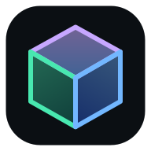

<p align="center">
  
</p>

<h1 align="center">OpenPanel</h1>

<h3 align="center">Managed kiosk launcher for Android tablets, Google TV and XR headsets</h3>

<p align="center">
  <a href="#install">Install</a> ·
  <a href="#build-from-source">Build</a> ·
  <a href="docs/arborxr-upload.md">ArborXR deploy</a> ·
  <a href="https://orgista.com">orgista.com</a>
</p>

<p align="center">
  <a href="LICENSE"></a>
  <a href="https://github.com/orgista/openpanel/actions/workflows/android.yml"></a>
  <a href="#compatibility"></a>
</p>

OpenPanel presents an approved catalog of apps and confines the device to it. One APK
(`com.orgista.openpanel`) covers phones and tablets, Google TV, and XR headsets such as
Meta Quest, Pico, Vive Focus and Lenovo. It runs next to ArborXR (companion mode) or
locks the device by itself (standalone mode).

This repository is the MIT-licensed engine: the Android project and the native bridge
the launcher UI calls. The React UI lives in
[orgista/openpanel-ui](https://github.com/orgista/openpanel-ui) and mounts at `src/`.

## Features

- Launches and lists installed apps through a native bridge (`SystemBridgePlugin`).
- Companion mode: ArborXR is Device Owner and handles lockdown, OpenPanel is the launcher UI.
- Standalone mode: OpenPanel registers as the HOME launcher and locks the device with device admin and lock task (screen pinning when it is not Device Owner).
- Detects when ArborXR (`app.xrdm.client`) is the Device Owner.
- Wi-Fi and Bluetooth control from inside the launcher: scan, connect, pair, forget.
- Battery status reporting.
- One APK for tablets (`LAUNCHER`), Google TV (`LEANBACK_LAUNCHER`) and XR headsets (runs as a 2D panel, no touchscreen required).
- App backup is disabled, and no signing keys or secrets live in the source.

## Install

There are no published releases yet. Build the APK from source (see below), then either:

- Upload the signed APK to ArborXR and assign it to a device or group. See [docs/arborxr-upload.md](docs/arborxr-upload.md).
- Sideload it on an unmanaged device and use the standalone kiosk flow.

## Compatibility

| Platform | Minimum | Notes |
| --- | --- | --- |
| Android phone and tablet | Android 7.0 (API 24) | Landscape orientation. Target SDK 36. |
| Google TV | Android 7.0 (API 24) | Listed through `LEANBACK_LAUNCHER`. |
| XR headsets | Android 7.0 (API 24) | Runs as a 2D panel. Works alongside ArborXR. |

## Build from source

The full APK needs the UI checked out at `src/`. Without it, this repo still builds and
compiles the native engine, which is what CI verifies.

Prerequisites: Node 22 or newer, JDK 21, and the Android SDK.

```bash
git clone https://github.com/orgista/openpanel.git && cd openpanel
git clone https://github.com/orgista/openpanel-ui.git src   # UI checkout
npm ci
npm run build                # vite: src/ -> dist/
npx cap sync android         # copy the web bundle and plugins into the native project
cd android && ./gradlew assembleDebug    # debug-signed, for development only
```

Release tasks refuse to run unless `OPENPANEL_KEYSTORE_FILE`, `OPENPANEL_KEYSTORE_PASS`,
`OPENPANEL_KEY_ALIAS` and `OPENPANEL_KEY_PASS` are provided. Java 17 fails Capacitor's
source level 21, so set `JAVA_HOME` to a JDK 21 install.

More detail: [docs/arborxr-upload.md](docs/arborxr-upload.md) (build and signing) and
[docs/open-source-split.md](docs/open-source-split.md) (what lives in which repo).

## Contributing

Issues and pull requests are welcome. Engine changes should pass the compile check in
`.github/workflows/android.yml`.

## License

MIT. See [LICENSE](LICENSE).
